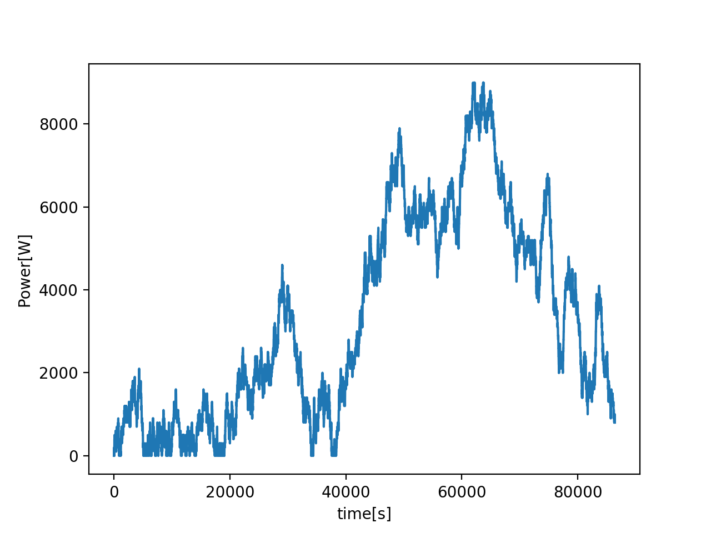
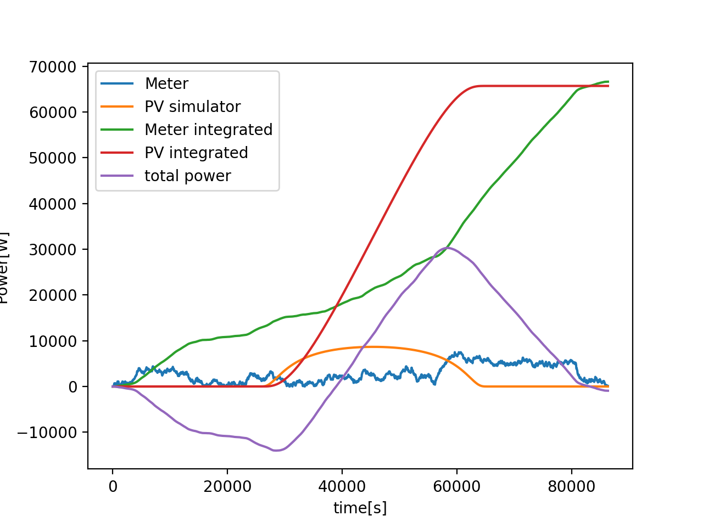

###############################################
#	PV simulator		              #
#					      #
#   writen by Y.Munwes 2020/03		      #
###############################################

This project simulate a power meter readout and PV readout
using rabbitMQ as a broker

Requeirments:
Install rabbitMQ using apt-get install rabbitmq (on Mac use brew install rabbitmq)
The meter class is simulated using random walk in randomWalk.py
For runnig the PV simulator install pvlib (pip install pvlib)

randomWalk.py paramters: (used by meter simulator)
Initial value, probabilites to go up or down, step resolution, and limits

meter.py:
Open connetion to broker and generate values using the randomWalk.
User can send arguments for changing the delay between each step (in sec), time difference in real time, and also to plot.
(example: python meter.py -plot=True -delay=0.000001)

pvSim.py:
Simulator class of PV using the pvlib library (see: https://pvlib-python-dacoex.readthedocs.io/en/latest/)
Simple simulation, with clear sky conditions
Parameter: device size, latitude, longitute, height, start/stop date and frequency

PV_simulator.py:
Open connection to the borker, simulate single day of PV values, once the broker send meter values it get the simulated PV value and calculate the difference+ the integration of the meters.
Save data to file results.txt

plotResult.py:
Plotting all values with respect to time

Run:
1. run rabbitmq-server
2. open web browser at http://localhost:15672, initial user and password: guest guest
2. python meter.py (another termianl, use -h to see parameters options)
3. python PV_simulator.py (another termianl)

if needed at the end run python plotResult.py

